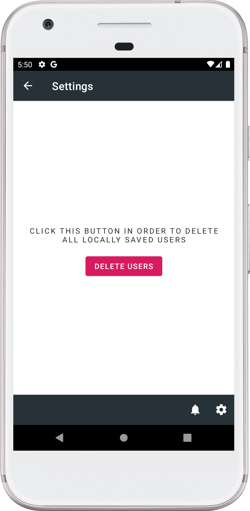

# RandomUsers

RandomUsers is a sample Android application with the main goal to cover clean architecture  

## Architecture & libraries
I used the following architecture, patterns and libraries:
* [Clean Architecture]
* [MVVM]
* [RxJava]
* [Koin]
* [Navigation]
* [Android Paging Library]
* [Retrofit]
* [Room]
* [Timber]
* [Glide]

## Screenshots

 
 

